# TailorCloud MVP 視覚化図表

**作成日**: 2025-01  
**バージョン**: 1.0.0  
**補足資料**: `95_MVP_Technical_Specification.md` の視覚化版

---

## 1. ER図（Mermaid形式）

### 1.1 完全ER図

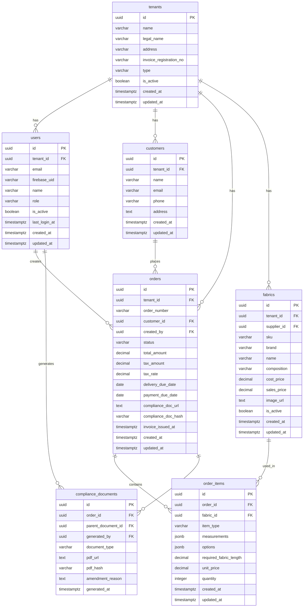

### 1.2 データフロー図

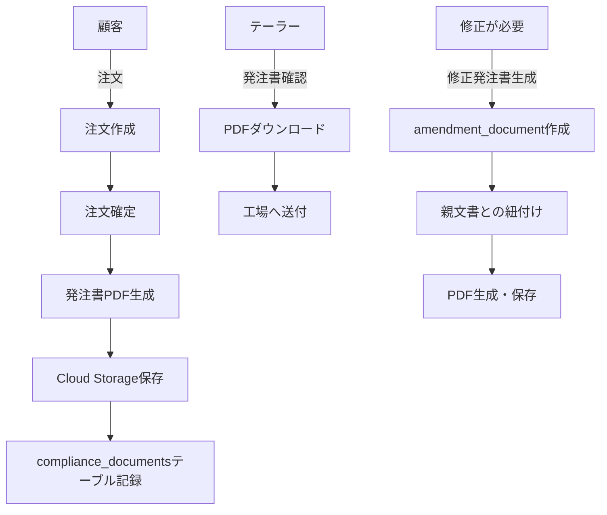

---

## 2. 画面遷移図（Mermaid形式）

### 2.1 全体フロー

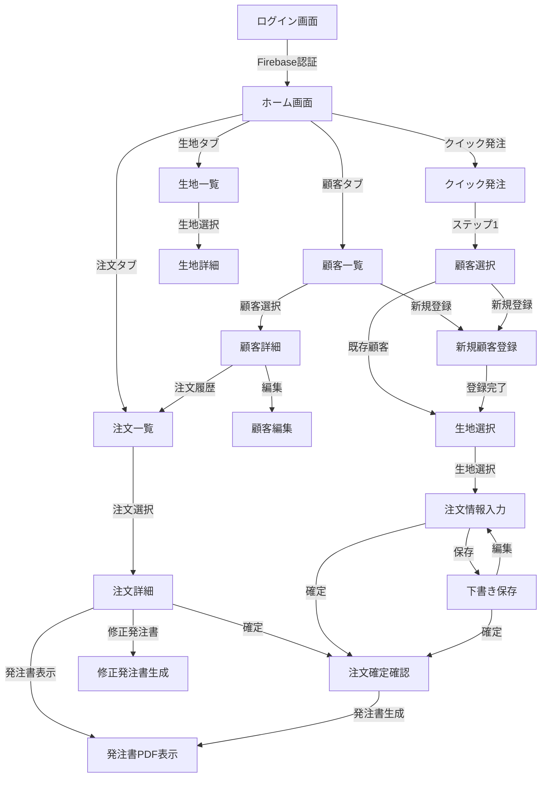

### 2.2 クイック発注フロー（詳細）

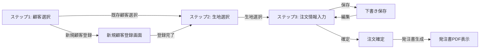

### 2.3 注文ステータス遷移

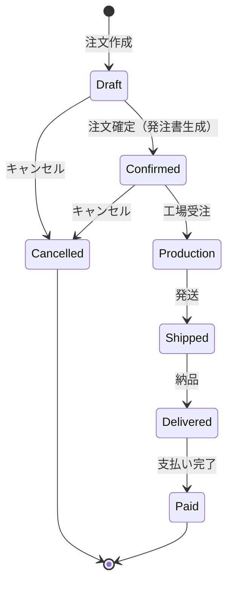

---

## 3. APIフロー図

### 3.1 注文作成フロー

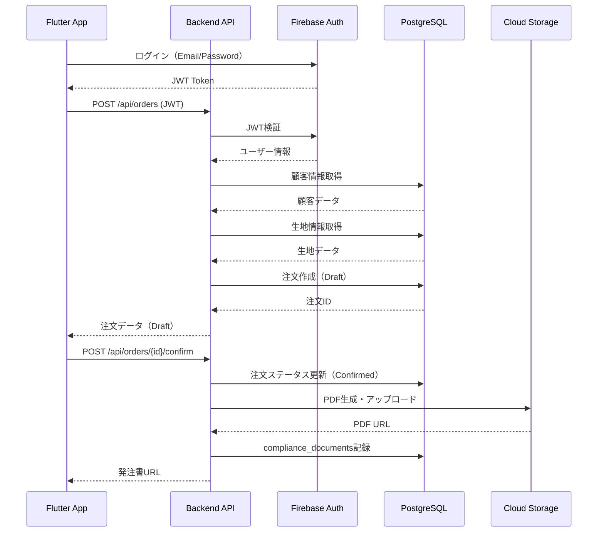

### 3.2 認証フロー

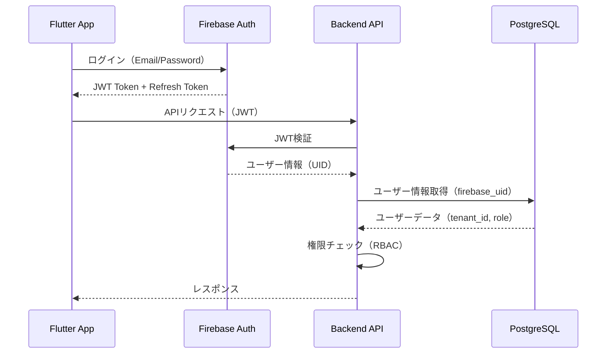

---

## 4. インフラ構成図（Mermaid形式）

### 4.1 全体構成

```mermaid
graph TB
    subgraph Client["クライアント層"]
        Flutter[Flutter App<br/>iOS/Android]
        Web[Web Portal<br/>React - 将来実装]
    end
    
    subgraph API["API層"]
        CloudRun[Cloud Run<br/>Go Backend API<br/>Auto Scaling]
    end
    
    subgraph Auth["認証層"]
        Firebase[Firebase Authentication<br/>JWT Token]
    end
    
    subgraph Data["データ層"]
        CloudSQL[Cloud SQL<br/>PostgreSQL<br/>Primary Database]
        CloudStorage[Cloud Storage<br/>PDF Documents<br/>Images]
    end
    
    subgraph Monitoring["監視層"]
        Logging[Cloud Logging<br/>構造化ログ]
        Monitoring[Cloud Monitoring<br/>メトリクス・アラート]
    end
    
    Flutter -->|HTTPS + JWT| CloudRun
    Web -->|HTTPS + JWT| CloudRun
    
    CloudRun -->|認証検証| Firebase
    CloudRun -->|データ取得| CloudSQL
    CloudRun -->|PDF保存| CloudStorage
    
    CloudRun -->|ログ送信| Logging
    CloudRun -->|メトリクス送信| Monitoring
```

### 4.2 データベース接続フロー

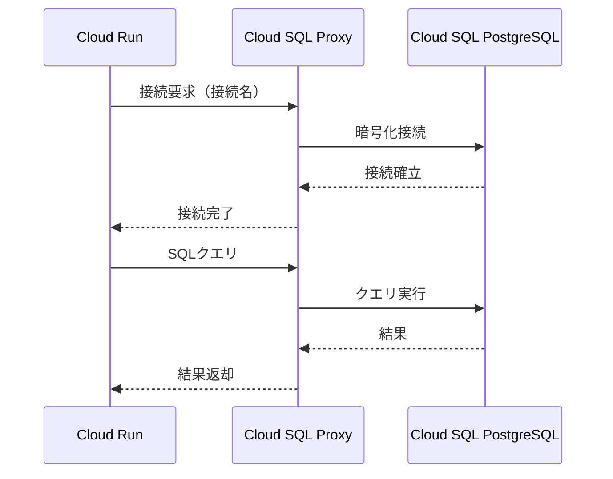

### 4.3 PDF生成・保存フロー

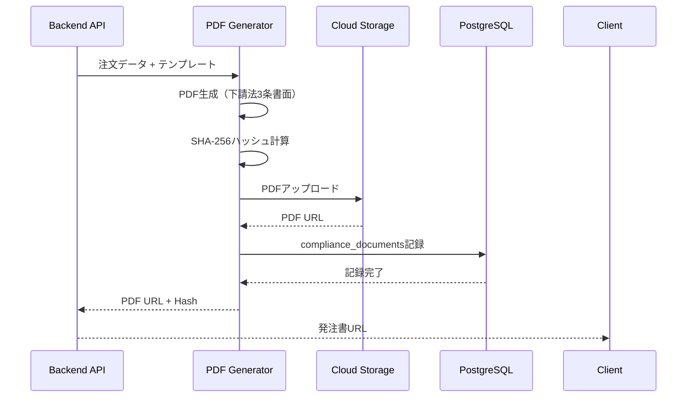

---

## 5. セキュリティフロー

### 5.1 マルチテナントデータ分離

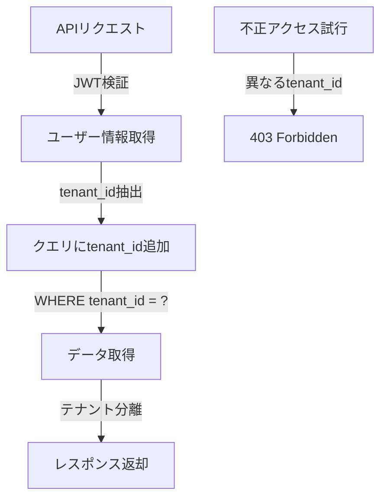

### 5.2 RBAC（ロールベースアクセス制御）

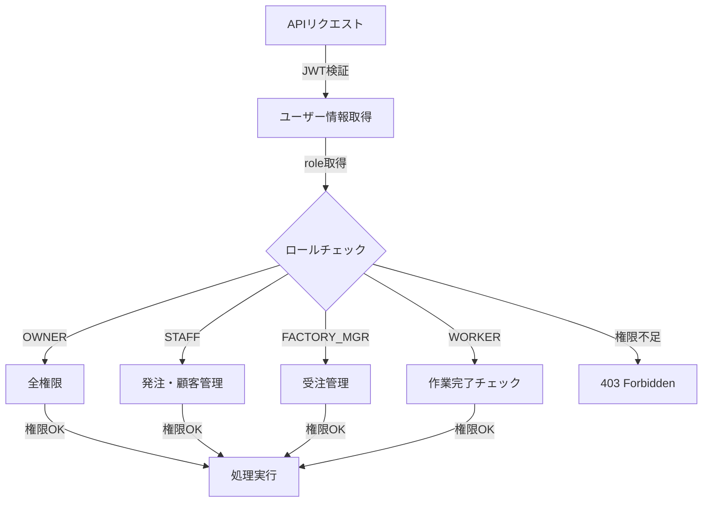

---

## 6. デプロイメントフロー

### 6.1 CI/CDパイプライン

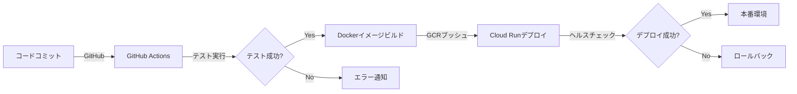

### 6.2 バージョン管理

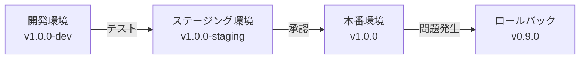

---

## 7. 監視・アラートフロー

### 7.1 メトリクス収集

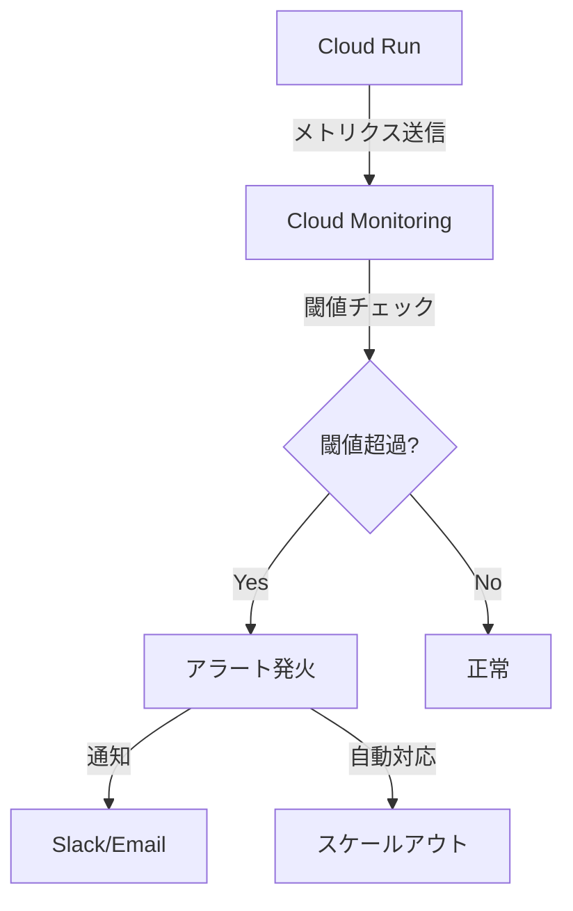

### 7.2 ログ分析

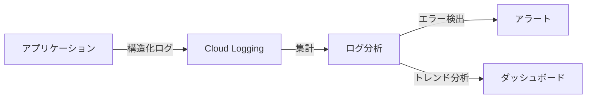

---

## 8. データフロー（注文確定から発注書生成まで）

### 8.1 詳細フロー

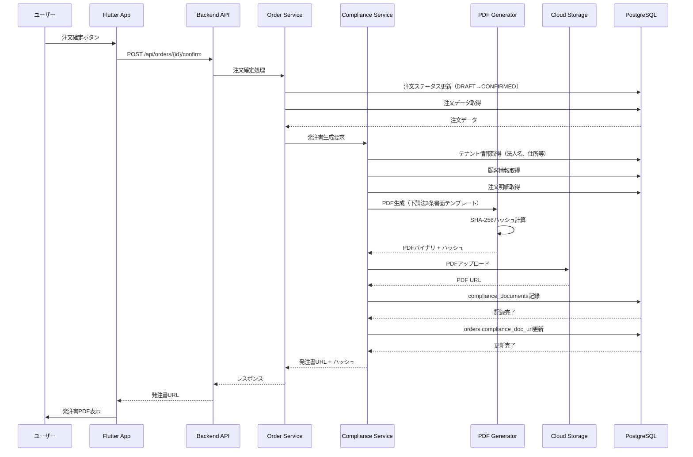

---

## 9. エラーハンドリングフロー

### 9.1 エラー処理の階層

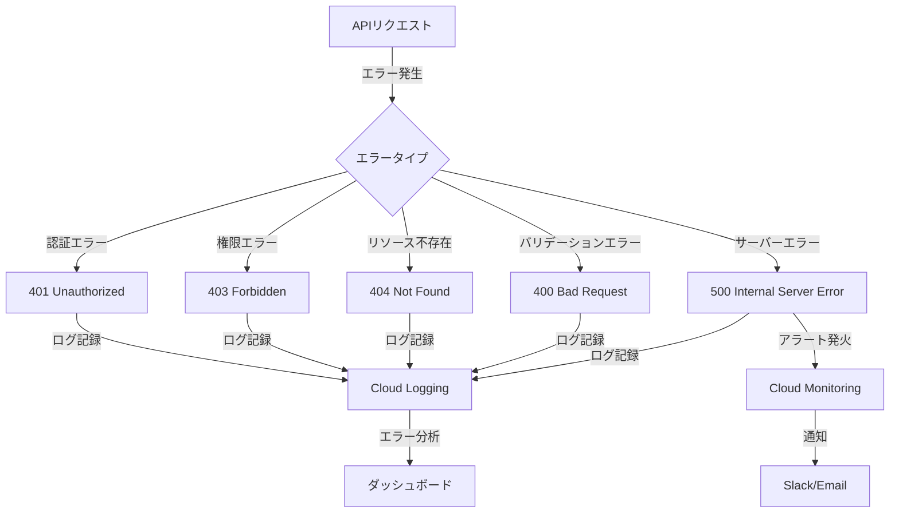

---

## 10. パフォーマンス最適化フロー

### 10.1 データベースクエリ最適化

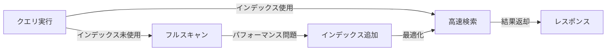

### 10.2 キャッシュ戦略（将来実装）

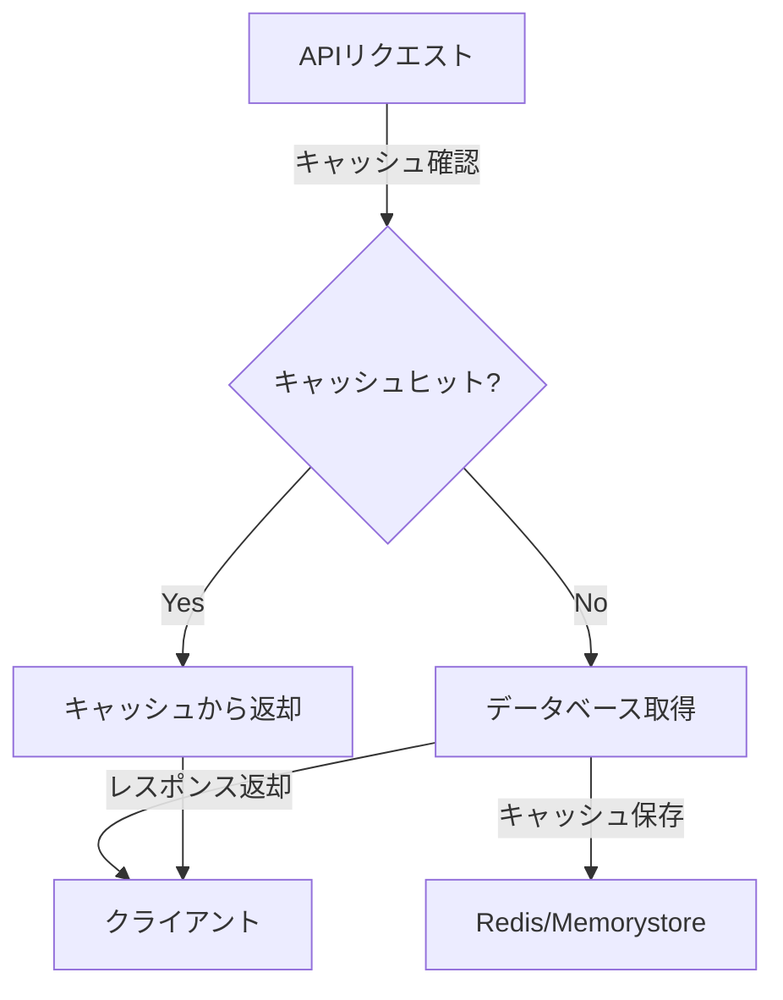

---

## まとめ

このドキュメントは、`95_MVP_Technical_Specification.md`の視覚化版です。Mermaid形式の図表により、システムの構造とフローを直感的に理解できます。

**使用方法**:
- GitHubやMarkdownビューアーでMermaid図を表示
- 設計レビュー時の資料として活用
- 開発チームへの説明資料として使用

---

**最終更新日**: 2025-01  
**バージョン**: 1.0.0  
**ステータス**: ✅ 視覚化図表完成

